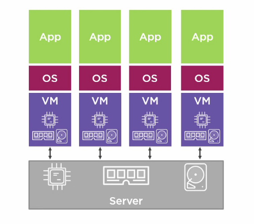
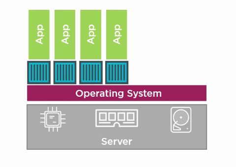

## Hypervisor virtualisation?
Hypervisor is the software that makes virtual machines work. Virtual machine (VM) is literally virtual version of a machine that dress up and look like a real one. Hypervisor is what enables allocation of resources to each VM on the same host.

## Why do we need Virtual Machine?
Back then, whenever we needed to host an application, an expensive and powerful server was bought. Along with the cost of this server, there are other costs to operate it. Turns out, the power of the server is never utilised due to low usage. That is when Virtual Machine comes to the rescue.

Virtual Machine allows us to:
* Run multiple applications on the same server
* Utilise the server's capability
* Only buy new servers when we really need them

In short, it is something like this diagram:

## Virtual Machine is still not the perfect solution
* Each VM takes a slice of the host hardwares - CPU, RAM, disk space
* Each VM needs its own Operating System (OS) and each OS uses a chunk of host hardwares without even running the application
* Requires admin time
* For each OS, you might need to pay license cost

## What is Docker then?
Similar to Hypervisor, Docker is the software that enables the creation of containerized applications

## Container?
According to Docker website:

>A container image is a lightweight, stand-alone, executable package of a piece of software that includes everything needed to run it: code, runtime, system tools, system libraries, settings.

* One app per container
* Get rid of VM, virtual hardwares, separate OSs for each and Hypervisor- more resources to be utilised
* Smaller than VM so more efficient
* More space so more containers
* Shares the same operating system across containers
* Containers spin up really fast since there no VMs and OSs that we need to boot to start.
* Applications will always be built/ran on the same environment so no more **'It works on my machine'** moments

## Wrap up
In my next post, I will walk through an example of how Docker can help in hosting/building a React website and maybe some stuffs on Buildkite too!

*Reference:* 
* [Docker](https://www.docker.com/) 
* [A crash course on Docker by Adnan Rahić on Medium](https://blog.sourcerer.io/a-crash-course-on-docker-learn-to-swim-with-the-big-fish-6ff25e8958b0)
